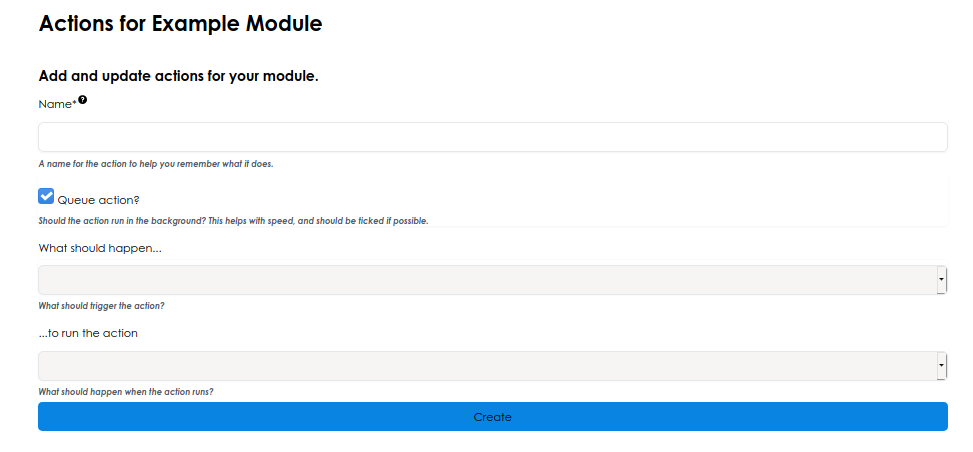
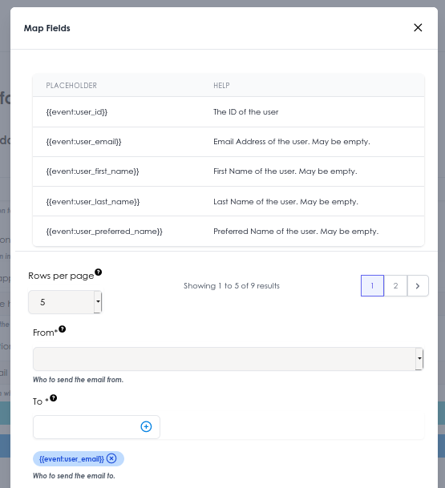

# Actions

Actions are a powerful tool for automating common tasks on the portal.

When a user takes an action such as uploading a file or filling in a form, we can do something off the back of that. This could be sending an email, tagging a group, or sending the event to Integromat to do something more advanced.

## Creating an Action

Head to the module through the build side of the site, and select the 'Actions' tab. The + button will add a new action.

Having given a name, you should set up what should happen to run the action. You can usually leave 'Queue action?' unticked.

> 
*Above: Create a new action*

The available 'What should happen' depends on the module. If you expect to see an event here that doesn't exist, let us know.

Also select the action - these will always be the same. 

Once you're ready, press 'Create' to create the action.

## Map fields & data

Having created your action, you should press 'Map Fields' to map data across.

!!! example "Why do we need to map fields?"

    I'd like to send a student an email when I update the status of a document they've uploaded.

    To do this, I have to find the email address of the person who uploaded the file. This data is held in the event, so I have to map the email address from the event to the email address field in the email action.

> 
*Above: Map event fields*

The available fields are shown at the top of the dialog. Copy the `{{ }}` for the field you want to map, and paste it into the action settings.
