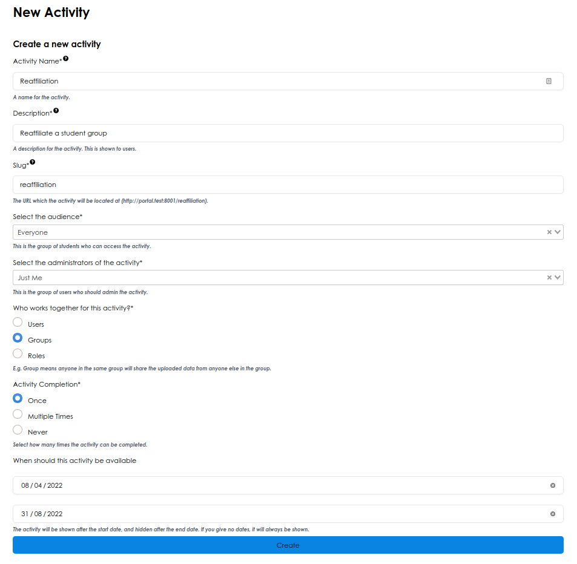

# Adding an activity

You can deliver any service you would like to through the portal by creating a new activity. 

Head to 'Manage Activities' and click the + button to add a new activity.

## Activity Form

> 
*Above: Create a new activity*

### Audience

You can limit who is able to complete a certain activity. For example, you may only want final year students to be able to access career advice, or only committee members to be able to reaffiliate.

Select the group of people who can interact with the service, and the group of people who are the admins for the service.

### Who works together?

Some services may only concern a user, such as an exam appeals service. For these, any data uploaded is private to the user.

Some services concern groups instead, such as Reaffiliation. Anyone in the group should be able to see the uploaded data for the group.

You can select which of the user/group/role selection you'd like for your activity from this page.

### Completion settings

You can alter how services should work when they've finished.

- For something like Reaffiliation, once it's done it's done. For this, select 'Once'.
- For something like an expense claim, you'd like to be able to do the service again and again. For this, select 'Multiple Times'. You can go back and see previous submissions, or start a new one.
- Finally, some services can never be completed. For example, an equipment list should be maintained during the year.
