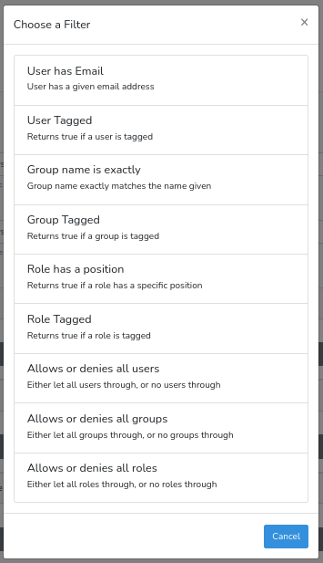
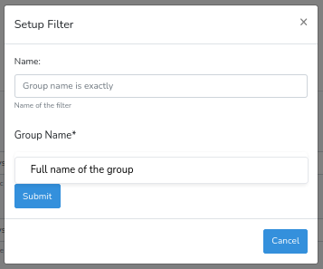

# Managing logic groups

Logic groups have already been used extensively to control who can see and do what on the portal.

You can build your own logic groups to define custom sets of users.

## Creating a logic group

Head to 'Create Logic' on the build side.

Once you've given a name and description to a logic group you will be able to add filters. These fall into four categories:

- All true: All the filters here MUST be met.
- Any true: At least one of the filters here must be met.
- All false: All the filters here must be false.
- Any false: At least one of these filters must not be met.

When adding a filter, select one of the options

> 
*Above: A list of filters*

You should add a name for the filter, and fill in any settings required for the filter. Click 'Submit' to save the filter, and 'Finish' to save the logic group.

> 
*Above: Adding a new filter*

It may take a few minutes for us to figure out who is in the group, but the group will keep itself up to date going forward.
