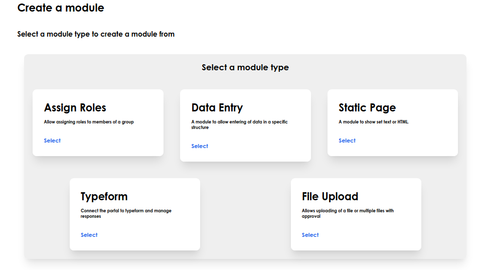
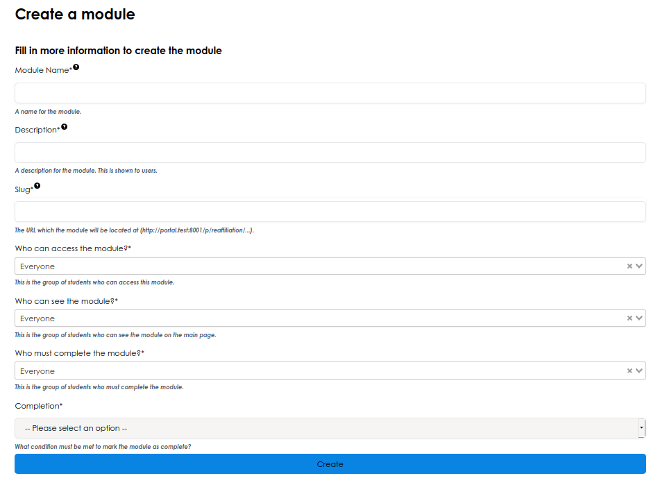
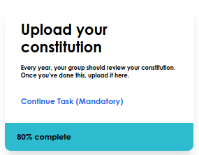
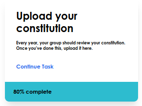
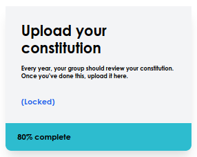
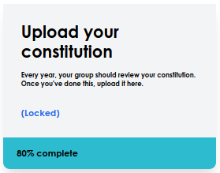

# Add a module

Once you've added an activity, you can add modules to it to add functionality. Step one is choosing the type of module you want to add.

> 
*Select the module type as the first step.*

You can then build up the module

> 
*Add information about the module*

## Access, see and complete modules

There are three main settings to configure here. You should select the groups of people who

- Can see the module exists
- Are able to access the module
- Must complete the module

If you can see the module but can't access it you'll see the module as 'locked'.

| Can see the module | Can access the module | Must complete the module |                                                                    |
|--------------------|-----------------------|--------------------------|--------------------------------------------------------------------|
| Yes                | Yes                   | Yes                      |  |
| Yes                | Yes                   | No                       |    |
| Yes                | No                    | Yes                      |  |
| Yes                | No                    | No                       |    |
| No                 | Yes/No                | Yes/No                   |                                |

## Module Settings

Each module will have settings to control how the page should work. These depend on the module type, so we've explained them in the 'Module' section.

## Module Permissions

You can control exactly who can do what on the page. Usually you should set this to the same as the 'audience' dropdown when creating the activity.

By setting a permission to 'No-one', the functionality will be removed. You can use this to take away the more complex functionality of modules.

The permissions listed are both for the admin and the student page, so you can control what staff can do in addition.
